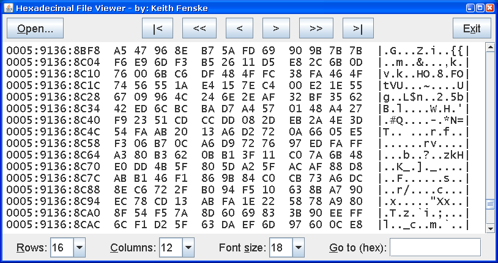

### Hex File Viewer (Java)

by: Keith Fenske, https://kwfenske.github.io/

HexView is a Java 1.4 graphical (GUI) application to display the contents of a
file in hexadecimal and as plain text (7-bit ASCII). Files may be very large.
Editing and searching are not supported.

Download the ZIP file here: https://kwfenske.github.io/hex-file-viewer-java.zip

Released under the terms and conditions of the Apache License (version 2.0 or
later) and/or the GNU General Public License (GPL, version 2 or later).

